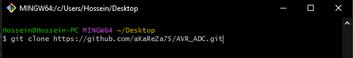
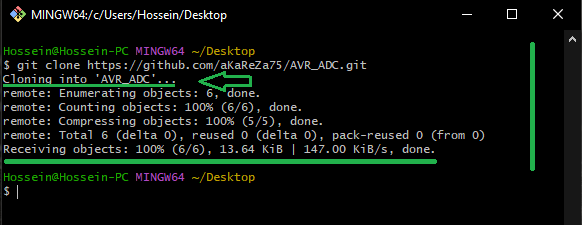
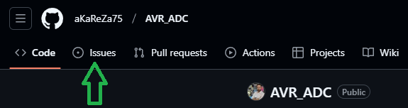
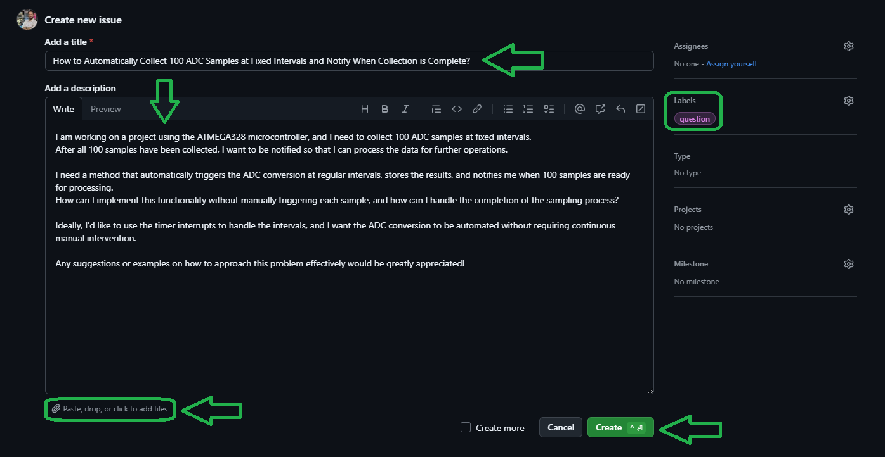

# ADC (Analog to Digital Converter)

The ADC (Analog-to-Digital Converter) in the ATMEGA328 is used to convert analog signals (voltages) into digital data that can be processed by the microcontroller. The ADC is typically used in applications where the input signal is an analog value, such as reading sensors, measuring voltages, etc. The ATMEGA328 features a 10-bit ADC, which provides a resolution of 1024 distinct values for any input voltage between 0 and the reference voltage.

The ADC on the ATMEGA328 is capable of reading multiple channels (pins) and can be configured for various reference voltages. It is essential to understand the registers controlling the ADC and how to utilize them to get accurate readings.

> [!CAUTION]
> It is absolutely critical that you carefully read every single word of this document, line by line, to ensure you don't miss any details. Nothing can be overlooked.

## Registers

The ADC module in the ATMEGA328 microcontroller is controlled by several registers. Below is a breakdown of the important registers associated with the ADC functionality, along with a detailed explanation of each bit in the register. The following table summarizes the bit structure of each register, followed by a detailed description of each bit.

### **1. ADC Control and Status Register A (ADCSRA)**

The **ADCSRA** register manages the overall operation of the ADC, including enabling the ADC, starting conversions, controlling the ADC clock, and enabling interrupts.

| Bit  | Name         | Description                                              |
|------|--------------|----------------------------------------------------------|
| 7    | **ADEN**     | ADC Enable (Enables the ADC)                             |
| 6    | **ADSC**     | ADC Start Conversion (Starts a conversion)               |
| 5    | **ADATE**    | ADC Auto Trigger Enable (Enable automatic trigger)       |
| 4    | **ADIF**     | ADC Interrupt Flag (Set when conversion is complete)     |
| 3    | **ADIE**     | ADC Interrupt Enable (Enable conversion interrupt)       |
| 2-0  | **ADPS2..0** | ADC Prescaler Select Bits (Select ADC clock prescaler)   |

- **ADEN (ADC Enable)**:  
  This bit enables the ADC module. When set to **1**, the ADC is powered on and ready for conversions. Setting it to **0** disables the ADC.

- **ADSC (ADC Start Conversion)**:  
  When set to **1**, this bit starts the ADC conversion on the selected channel. The conversion process will begin, and the bit will automatically be cleared once the conversion is completed.

- **ADATE (ADC Auto Trigger Enable)**:  
  Setting this bit to **1** enables automatic triggering of ADC conversions based on specific events, such as timer overflows, external interrupts, etc. If this bit is cleared to **0**, conversions must be started manually by setting the **ADSC** bit.

- **ADIF (ADC Interrupt Flag)**:  
  This bit is set to **1** when the ADC conversion is complete. If interrupts are enabled (by setting **ADIE**), this flag triggers an interrupt. It is cleared by reading the ADC Data Register or by setting it manually.

- **ADIE (ADC Interrupt Enable)**:  
  This bit enables the interrupt for ADC conversion completion. If **ADIE** is set to **1**, the interrupt will trigger when **ADIF** is set. If **ADIE** is cleared, no interrupt will occur.

- **ADPS2..0 (ADC Prescaler Select Bits)**:  
  These three bits control the prescaler for the ADC clock. The ADC requires a clock frequency between 50 kHz and 200 kHz for optimal performance. These bits determine the division factor applied to the system clock to generate the ADC clock. Example settings:
  - **000**: Divide by 2
  - **001**: Divide by 2
  - **010**: Divide by 4
  - **011**: Divide by 8
  - **100**: Divide by 16
  - **101**: Divide by 32
  - **110**: Divide by 64
  - **111**: Divide by 128

### **2. ADC Multiplexer Selection Register (ADMUX)**

The **ADMUX** register selects the input channel for the ADC and the reference voltage for the conversion.

| Bit  | Name       | Description                                         |
|------|------------|-----------------------------------------------------|
| 7    | **ADLAR**  | ADC Left Adjust Result (Adjusts result alignment)   |
| 6-4  | **MUX3..0**| ADC Channel Select Bits (Selects input channel)     |
| 3-2  | **REFS1..0**| Reference Voltage Selection Bits (Select reference voltage) |
| 1-0  | -          | Reserved (Not used)                                 |

- **ADLAR (ADC Left Adjust Result)**:  
  This bit controls the alignment of the ADC result. When set to **1**, the result is left-aligned in the ADC Data Registers (i.e., the 10-bit result is placed in the high byte **ADCH**). If cleared to **0**, the result is right-aligned (i.e., the 10-bit result is placed in the low byte **ADCL**).

To provide a clearer visualization of how the 10-bit ADC result is stored in the **ADCL** and **ADCH** registers based on the **ADLAR** setting, here's a table showing both **left-alignment** and **right-alignment** for the example ADC result of **963**.

- **ADC Result (963 Decimal) = 0x03C3 (Hexadecimal)**
- **Binary Representation**: **0000001111000011** (10 bits)

#### **Left Alignment (ADLAR = 1)**
When **ADLAR** is set to **1**, the 10-bit result is **left-aligned**, so the most significant bits (MSBs) are placed in **ADCH** (high byte) and the least significant bits (LSBs) in **ADCL** (low byte).

| Register  | Bit Position | 7    | 6    | 5    | 4    | 3    | 2    | 1    | 0    |
|-----------|--------------|------|------|------|------|------|------|------|------|
| **ADCH**  | High Byte    | **0**  | **0**  | **0**  | **0**  | **0**  | **1**  | **1**  | **0**  |
| **ADCL**  | Low Byte     | **1**  | **1**  | **1**  | **1**  | **0**  | **0**  | **0**  | **1**  |

##### Explanation:
- **ADCH**: Contains the 2 most significant bits (**00** from the higher part of the result `0x03C3` → 0x03).
- **ADCL**: Contains the 8 least significant bits (**11110001** from the lower part of the result `0x03C3` → 0xF1).

#### **Right Alignment (ADLAR = 0)**
When **ADLAR** is cleared to **0**, the 10-bit result is **right-aligned**, meaning the least significant bits (LSBs) are placed in **ADCL** and the most significant bits (MSBs) in **ADCH**.

| Register  | Bit Position | 7    | 6    | 5    | 4    | 3    | 2    | 1    | 0    |
|-----------|--------------|------|------|------|------|------|------|------|------|
| **ADCH**  | High Byte    | **0**  | **0**  | **0**  | **0**  | **1**  | **1**  | **1**  | **1**  |
| **ADCL**  | Low Byte     | **0**  | **0**  | **0**  | **1**  | **1**  | **0**  | **0**  | **1**  |

##### Explanation:
- **ADCH**: Contains the 2 most significant bits (**11110000** from the higher part of the result `0x03C3` → 0xF0).
- **ADCL**: Contains the 8 least significant bits (**00000011** from the lower part of the result `0x03C3` → 0x03).


- **MUX3..0 (ADC Channel Select Bits)**:  
  These bits select the input channel for the ADC. The ATMEGA328 provides up to 8 channels (0–7), which are used for reading analog signals. Example:
  - **0000**: ADC Channel 0
  - **0001**: ADC Channel 1
  - **0010**: ADC Channel 2
  - **0111**: ADC Channel 7

- **REFS1..0 (Reference Voltage Selection Bits)**:  
  These bits determine the reference voltage used for ADC conversion. The available settings are:
  - **00**: AREF, with the internal reference voltage turned off.
  - **01**: AVCC with an external capacitor at the AREF pin.
  - **10**: Internal 1.1V reference voltage with an external capacitor at the AREF pin.
  - **11**: Reserved (not commonly used).

### **3. ADC Data Registers (ADCL, ADCH)**

These registers hold the result of the ADC conversion. The result is stored as a 10-bit value, with the lower 8 bits stored in **ADCL** and the upper 2 bits stored in **ADCH**.

| Bit  | Name   | Description                                      |
|------|--------|--------------------------------------------------|
| 7-0  | **ADCL**| Lower 8 bits of the ADC result (10-bit result)    |
| 9-8  | **ADCH**| Upper 2 bits of the ADC result (10-bit result)    |

- **ADCL (ADC Data Register Low Byte)**:  
  This register contains the lower 8 bits of the 10-bit ADC result. It stores the least significant bits, which are read first after the conversion is complete.

- **ADCH (ADC Data Register High Byte)**:  
  This register holds the upper 2 bits of the 10-bit ADC result. These bits are read after the lower 8 bits have been read from **ADCL**. The ADC result is a combination of these two registers to form the complete 10-bit value.

### **4. ADC Control and Status Register B (ADCSRB)**

The **ADCSRB** register controls additional features for the ADC, such as auto-triggering, free-running mode, and other specific features that allow for greater flexibility in ADC operations.

| Bit  | Name         | Description                                             |
|------|--------------|---------------------------------------------------------|
| 7    | **ADTS2**    | ADC Trigger Source Select Bit 2 (Part of Auto-Trigger Source) |
| 6    | **ADTS1**    | ADC Trigger Source Select Bit 1 (Part of Auto-Trigger Source) |
| 5    | **ADTS0**    | ADC Trigger Source Select Bit 0 (Part of Auto-Trigger Source) |
| 4    | **ACME**     | Analog Comparator Multiplexer Enable (Selects ADC input from the analog comparator output) |
| 3-0  | **Reserved** | Reserved bits (not used)                                 |


- **ADTS2..0 (ADC Trigger Source Select Bits)**:  
  These three bits select the source of the auto-trigger for the ADC conversion. When enabled, ADC conversions can be triggered automatically by various events like a timer overflow or an external interrupt. The possible settings for these bits are:
  - **000**: Free running mode (conversions happen continuously).
  - **001**: Triggered by an external interrupt (INT0).
  - **010**: Triggered by the timer/counter 0 overflow.
  - **011**: Triggered by the timer/counter 0 compare match.
  - **100**: Triggered by the timer/counter 1 overflow.
  - **101**: Triggered by the timer/counter 1 compare match A.
  - **110**: Triggered by the timer/counter 1 compare match B.
  - **111**: Triggered by an external pin (like INT1).

- **ACME (Analog Comparator Multiplexer Enable)**:  
  This bit enables the analog comparator as an input to the ADC, allowing the ADC to sample the output of the analog comparator. Setting this bit to **1** selects the analog comparator's output as the input for the ADC, instead of a regular ADC channel.


### **5. Digital Input Disable Register 0 (DIDR0)**

The **DIDR0** register disables the digital input buffers on certain pins, making the analog input pins fully isolated from digital circuitry. This is useful for minimizing power consumption and preventing digital signals from interfering with analog measurements.

| Bit  | Name     | Description                                                 |
|------|----------|-------------------------------------------------------------|
| 7    | **ADC7D**| Digital Input Disable for ADC Channel 7                     |
| 6    | **ADC6D**| Digital Input Disable for ADC Channel 6                     |
| 5    | **ADC5D**| Digital Input Disable for ADC Channel 5                     |
| 4    | **ADC4D**| Digital Input Disable for ADC Channel 4                     |
| 3    | **ADC3D**| Digital Input Disable for ADC Channel 3                     |
| 2    | **ADC2D**| Digital Input Disable for ADC Channel 2                     |
| 1    | **ADC1D**| Digital Input Disable for ADC Channel 1                     |
| 0    | **ADC0D**| Digital Input Disable for ADC Channel 0                     |

- **ADCxD (Digital Input Disable for ADC Channel x)**:  
  Each bit in the **DIDR0** register corresponds to a specific ADC channel (from ADC0 to ADC7). Setting a bit to **1** disables the digital input buffer for the corresponding channel, ensuring that the pin functions purely as an analog input. This reduces power consumption and minimizes potential interference from the digital side of the microcontroller.

For example:
- Setting **ADC0D** to **1** disables the digital input buffer for ADC channel 0.
- Setting **ADC7D** to **1** disables the digital input buffer for ADC channel 7.

By disabling the digital input buffers, the ADC channels are dedicated solely to analog readings, which can improve the quality and accuracy of your measurements, especially in low-power applications.

## API Reference

This section provides detailed descriptions of the functions used to interact with the ADC peripheral of the ATMEGA328 microcontroller. These functions are part of the custom library for accessing and utilizing the ADC hardware. Each function is explained with its purpose and usage, accompanied by code examples to demonstrate how they can be implemented in your projects.

> [!NOTE]  
> The library and all of its APIs provided below have been developed by myself.  
This library utilizes various macros defined in the `aKaReZa.h` header file, which are designed to simplify bitwise operations and register manipulations.    
Detailed descriptions of these macros can be found at the following link:  
> [https://github.com/aKaReZa75/AVR/blob/main/Macros.md](https://github.com/aKaReZa75/AVR/blob/main/Macros.md)  

| Setting                         | Value                           |
|---------------------------------|---------------------------------|
| **CPU Frequency**               | 16 MHz                          |
| **Prescaler**                   | 128                             |
| **Reference Voltage**           | AVCC                            |
| **Result Alignment**            | Right Alignment                 |
| **Measurement Method**          | Polling                         |

### **Initialization**
```c
void adc_Init(bool _initStatus);
```
* This function configures the ADC to use the default settings for the input channel and reference voltage.
* It also enables the ADC and sets the appropriate prescaler for ADC clock.
* @param `_initStatus`:  
   - If `_initStatus` is set to `Initialize`, the USART module will be configured and enabled.
   - If `_initStatus` is set to `deInitialize`, the USART module will be disabled and deinitialized. 
   
**Example:**
```c
#include "aKaReZa.h"
#include "adc.h"

int main(void) 
{
    adc_Init(Initialize); /**< Initialize ADC with default settings */
    while(1)
    {
        /* Your code here */
    }
}
```

### **Internal Temperature Sensor**
```c
int8_t adc_internalTemp(void);
```
* This function returns the ADC result from the internal temperature sensor.

**Example:**
```c
#include "aKaReZa.h"
#include "adc.h"

int8_t tempValue = 0;

int main(void) 
{
    adc_Init(Initialize); /**< Initialize ADC with default settings */
    tempValue = adc_internalTemp(); /**< Get the temperature value from the internal sensor */
    while(1)
    {
        /* Use the tempValue */
    }
}
```

### **ADC Read**
```c
uint16_t adc_Read(uint8_t _adcChannel);
```
* This function returns the 10-bit result from the specified ADC channel.
- @param `_adcChannel`: Specifies the ADC channel to be read. It is an 8-bit value, where each bit represents an ADC input channel (0-7 for the ATMEGA328).
  
> [!IMPORTANT]
The ATMEGA328's ADC operates **sequentially**, meaning that you cannot read multiple channels **simultaneously**. To read data from multiple ADC channels, you need to read each channel one by one, performing an individual conversion for each channel.   
This process is not parallel, so you'll need to configure the ADC to select the desired channel before each conversion, and wait for the conversion to complete before moving on to the next channel. While this means the readings are not simultaneous, it allows for accurate sampling of each individual channel.


**Example:**
```c
#include "aKaReZa.h"
#include "adc.h"

uint16_t adcResult = 0;

int main(void) 
{
    adc_Init(Initialize); /**< Initialize ADC with default settings */
    adcResult = adc_Read(0); /**< Read the ADC value from channel 0 */
    while(1)
    {
        /* Use the adcResult */
    }
}
```

### Summary
| API Function         | Description                                       |
|----------------------|---------------------------------------------------|
| `adc_Init`           | Initializes the ADC module with default settings. |
| `adc_internalTemp`   | Reads the internal temperature sensor.            |
| `adc_Read`           | Reads the ADC value from a specified channel.     |

## Complete Example

```c
#include "aKaReZa.h"
#include "adc.h"

uint16_t adcResult = 0;

int main(void) 
{
    adc_Init(Initialize); /**< Initialize the ADC with default settings */
    while(1)
    {
        adcResult = adc_Read(0); /**< Read ADC from channel 0 */
        /* Example usage of ADC result */
        if (adcResult > 512)
        {
            bitSet(PORTB, 0); /**< Set PORTB0 if ADC result is greater than 512 */
        }
        else
        {
            bitClear(PORTB, 0); /**< Clear PORTB0 if ADC result is less than 512 */
        }
    }
}
```

## **Converting Voltage to ADC Value:**

When we apply an analog voltage to the ADC input, the ADC converts this voltage into a digital value. The ADC resolution (in this case, 10 bits) defines the number of discrete levels the ADC can represent. For a 10-bit ADC, the range of values is from 0 to 1023 (1024 levels). The actual value obtained by the ADC depends on the input voltage relative to the reference voltage.

### **Key Parameters for Conversion:**
1. **ADC Resolution**: **10 bits** (This means the ADC result will range from 0 to 1023, representing 1024 levels of the input voltage.)
2. **Reference Voltage**: The reference voltage used for the conversion (in this case, **AVCC** as selected earlier).
3. **Input Voltage (V_in)**: The actual voltage applied to the ADC input pin.

### **Formula for Conversion (Voltage to ADC Value):**
To convert a given input voltage \( V_{in} \) to the corresponding ADC value:

```c
// To convert the input voltage to ADC value:
ADC_value = (V_in / V_ref) * 1023
```

Where:
- `ADC_value` is the digital value obtained from the ADC conversion (ranges from 0 to 1023).
- `V_in` is the input voltage (voltage applied to the ADC input pin).
- `V_ref` is the reference voltage (e.g., AVCC, typically 5V or 3.3V).

### **Example Calculation (Voltage to ADC Value):**
```c
// Assume:
// Input voltage = 2.5V
// Reference Voltage = 5V

ADC_value = (2.5 / 5) * 1023  // Convert voltage to ADC value
ADC_value = 511.5             // So the corresponding ADC value is approximately 512
```

This means that when a **2.5V** input is applied to the ADC with a **5V reference**, the ADC value will be approximately **512** (rounding to the nearest integer).

### **Conclusion:**

- **Voltage to ADC Value**: You can convert an input voltage to an ADC value using the formula:

  ```c
  ADC_value = (V_in / V_ref) * 1023
  ```

  For example, a **2.5V** input with a **5V reference** results in an ADC value of **512**.

## **Converting ADC Value to Voltage:**

Once the ADC conversion is complete, the result is a digital value that represents the analog input voltage in a certain range based on the reference voltage. To convert the ADC value back to the actual voltage applied to the input pin, use the following method:

### **Formula for Conversion (ADC Value to Voltage):**
To convert the ADC value back to the input voltage \( V_{in} \), the formula is:

```c
// To convert the ADC value to the input voltage:
V_in = (ADC_value / 1023) * V_ref
```

Where:
- `V_in` is the input voltage (voltage applied to the ADC input pin).
- `ADC_value` is the digital value obtained from the ADC conversion (ranges from 0 to 1023).
- `V_ref` is the reference voltage (e.g., AVCC, typically 5V or 3.3V).

### **Example Calculation (ADC Value to Voltage):**
```c
// Assume:
// ADC result = 512
// Reference Voltage = 5V

V_in = (512 / 1023) * 5V   // Convert ADC value to voltage
V_in = 2.5V                // So the corresponding input voltage is 2.5V
```

This means that an ADC value of **512** corresponds to an input voltage of **2.5V** when using a **5V reference**.

### **Conclusion:**

- **ADC Value to Voltage**: You can convert the ADC value back to the input voltage using the formula:

  ```c
  V_in = (ADC_value / 1023) * V_ref
  ```

  For example, an ADC value of **512** with a **5V reference** corresponds to an input voltage of **2.5V**.

## **ADC Conversion Time**

The time it takes for an ADC conversion to complete depends on several factors, such as the ADC resolution, the ADC clock, and the prescaler setting. In the case of the ATMEGA328 microcontroller with a **16 MHz CPU clock**, a **prescaler of 128**, and a **10-bit ADC resolution**, we can calculate the time it takes for one conversion.

### **Key Parameters:**
1. **CPU Frequency**: **16 MHz** (16,000,000 Hz)
2. **ADC Prescaler**: **128** (Set using **ADPS2**, **ADPS1**, and **ADPS0** bits)
3. **ADC Resolution**: **10 bits** (This means the ADC produces a 10-bit result, which requires 1024 discrete levels)
4. **ADC Conversion Clock**: The ADC clock is derived from the CPU clock and is divided by the prescaler.

### **ADC Clock Frequency Calculation:**

The ADC clock frequency is calculated by dividing the CPU clock frequency by the prescaler:

```markdown
ADC Clock = (CPU Frequency / Prescaler) = (16 MHz / 128) = 125 kHz
```

So, the ADC is running at a frequency of **125 kHz**.

### **ADC Conversion Time:**

The ATMEGA328's ADC takes 13 ADC clock cycles to perform a **single 10-bit conversion**. This time includes the steps for sampling and conversion.

```markdown
Conversion Time = 13 ADC Clock Cycles
```

Since the ADC clock frequency is **125 kHz**, the time per ADC clock cycle is the inverse of the clock frequency:

```markdown
ADC Clock Cycle Time = 1 / 125,000 = 8 microseconds
```

Now, multiply the ADC clock cycle time by the number of clock cycles required for a conversion:

```markdown
ADC Conversion Time = 13 * 8 microseconds = 104 microseconds
```

### **Conclusion:**

With a **16 MHz CPU frequency** and an **ADC prescaler of 128**, the time it takes to complete one ADC conversion in 10-bit resolution is approximately **104 microseconds**.


### **Important Notes**

- **Reference Voltage**: The accuracy of the ADC result depends on the reference voltage. If you're using the internal 1.1V reference, be sure to account for the actual voltage value, as it may vary slightly across different microcontroller units.
  
- **Input Impedance**: The ADC requires a low-impedance source to obtain accurate readings. If your input signal has high impedance, consider using a buffer or amplifier to improve the signal quality.
  
- **Overvoltage**: Ensure that the input voltage is within the allowable range for the ADC. Voltages higher than the reference voltage can damage the microcontroller.

# 🔗 Resources
  Here you'll find a collection of useful links and videos related to the topic of AVR microcontrollers.  
  
> [!TIP]
> The resources are detailed in the sections below.  
> To access any of them, simply click on the corresponding blue link.

- [aKaReZa 77 - AVR, Analog - ADC](https://youtu.be/SJJGwX5tNis)  
  ---  
    Learn about the features of the Analog-to-Digital Converter (ADC) in AVR microcontrollers, including block diagrams, control and data registers, voltage measurement, multi-channel measurement, analog temperature sensor connection, internal temperature sensor usage, and noise canceler capabilities.

- [AVR Microntroller](https://github.com/aKaReZa75/AVR)
  ---  
    This repository contains comprehensive resources for AVR microcontrollers, including hardware schematics, software libraries, and educational projects.


# 💻 How to Use Git and GitHub
To access the repository files and save them on your computer, there are two methods available:
1. **Using Git Bash and Cloning the Repository**
   - This method is more suitable for advanced users and those familiar with command-line tools.
   - By using this method, you can easily receive updates for the repository.

2. **Downloading the Repository as a ZIP file**
   - This method is simpler and suitable for users who are not comfortable with command-line tools.
   - Note that with this method, you will not automatically receive updates for the repository and will need to manually download any new updates.

## Clone using the URL.
First, open **Git Bash** :
-  Open the folder in **File Explorer** where you want the library to be stored.
-  **Right-click** inside the folder and select the option **"Open Git Bash here"** to open **Git Bash** in that directory.


> [!NOTE] 
> If you do not see the "Open Git Bash here" option, it means that Git is not installed on your system.  
> You can download and install Git from [this link](https://git-scm.com/downloads).  
> For a tutorial on how to install and use Git, check out [this video](https://youtu.be/BsykgHpmUt8).
  
-  Once **Git Bash** is open, run the following command to clone the repository:

 ```bash
git clone https://github.com/aKaReZa75/AVR_ADC.git
```
- You can copy the above command by either:
- Clicking on the **Copy** button on the right of the command.
- Or select the command text manually and press **Ctrl + C** to copy.
- To paste the command into your **Git Bash** terminal, use **Shift + Insert**.



- Then, press Enter to start the cloning operation and wait for the success message to appear.



> [!IMPORTANT]
> Please keep in mind that the numbers displayed in the image might vary when you perform the same actions.  
> This is because repositories are continuously being updated and expanded. Nevertheless, the overall process remains unchanged.

> [!NOTE]
> Advantage of Cloning the Repository:  
> - **Receiving Updates:** By cloning the repository, you can easily and automatically receive new updates.  
> - **Version Control:** Using Git allows you to track changes and revert to previous versions.  
> - **Team Collaboration:** If you are working on a project with a team, you can easily sync changes from team members and collaborate more efficiently.  

## Download Zip
If you prefer not to use Git Bash or the command line, you can download the repository directly from GitHub as a ZIP file.  
Follow these steps:  
1. Navigate to the GitHub repository page and Locate the Code button:
   - On the main page of the repository, you will see a green Code button near the top right corner.

2. Download the repository:
   - Click the Code button to open a dropdown menu.
   - Select Download ZIP from the menu.

    

3. Save the ZIP file:
   - Choose a location on your computer to save the ZIP file and click Save.

4. Extract the ZIP file:
   - Navigate to the folder where you saved the ZIP file.
   - Right-click on the ZIP file and select Extract All... (Windows) or use your preferred extraction tool.
   - Choose a destination folder and extract the contents.

5. Access the repository:
   - Once extracted, you can access the repository files in the destination folder.

> [!IMPORTANT]
> - No Updates: Keep in mind that downloading the repository as a ZIP file does not allow you to receive updates.    
>   If the repository is updated, you will need to download it again manually.  
> - Ease of Use: This method is simpler and suitable for users who are not comfortable with Git or command-line tools.

# 📝 How to Ask Questions
If you have any questions or issues, you can raise them through the **"Issues"** section of this repository. Here's how you can do it:  

1. Navigate to the **"Issues"** tab at the top of the repository page.  

  

2. Click on the **"New Issue"** button.  
   
  

3. In the **Title** field, write a short summary of your issue or question.  

4. In the "Description" field, detail your question or issue as thoroughly as possible. You can use text formatting, attach files, and assign the issue to someone if needed. You can also use text formatting (like bullet points or code snippets) for better readability.  

5. Optionally, you can add **labels**, **type**, **projects**, or **milestones** to your issue for better categorization.  

6. Click on the **"Submit new issue"** button to post your question or issue.
   
  

I will review and respond to your issue as soon as possible. Your participation helps improve the repository for everyone!  

> [!TIP]
> - Before creating a new issue, please check the **"Closed"** section to see if your question has already been answered.  
>     
> - Write your question clearly and respectfully to ensure a faster and better response.  
> - While the examples provided above are in English, feel free to ask your questions in **Persian (فارسی)** as well.  
> - There is no difference in how they will be handled!  

> [!NOTE]
> Pages and interfaces may change over time, but the steps to create an issue generally remain the same.

# 🤝 Contributing to the Repository
To contribute to this repository, please follow these steps:
1. **Fork the Repository**  
2. **Clone the Forked Repository**  
3. **Create a New Branch**  
4. **Make Your Changes**  
5. **Commit Your Changes**  
6. **Push Your Changes to Your Forked Repository**  
7. **Submit a Pull Request (PR)**  

> [!NOTE]
> Please ensure your pull request includes a clear description of the changes you’ve made.
> Once submitted, I will review your contribution and provide feedback if necessary.

# 🌟 Support Me
If you found this repository useful:
- Subscribe to my [YouTube Channel](https://www.youtube.com/@aKaReZa75).
- Share this repository with others.
- Give this repository and my other repositories a star.
- Follow my [GitHub account](https://github.com/aKaReZa75).

# 📜 License
This project is licensed under the GPL-3.0 License. This license grants you the freedom to use, modify, and distribute the project as long as you:
- Credit the original authors: Give proper attribution to the original creators.
- Disclose source code: If you distribute a modified version, you must make the source code available under the same GPL license.
- Maintain the same license: When you distribute derivative works, they must be licensed under the GPL-3.0 too.
- Feel free to use it in your projects, but make sure to comply with the terms of this license.
  
# ✉️ Contact Me
Feel free to reach out to me through any of the following platforms:
- 📧 [Email: aKaReZa75@gmail.com](mailto:aKaReZa75@gmail.com)
- 🎥 [YouTube: @aKaReZa75](https://www.youtube.com/@aKaReZa75)
- 💼 [LinkedIn: @akareza75](https://www.linkedin.com/in/akareza75)
